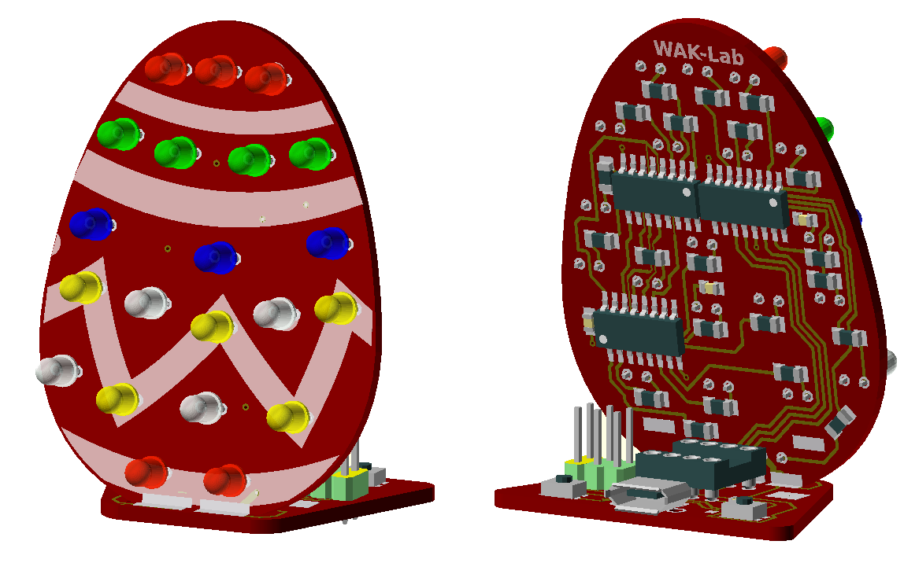
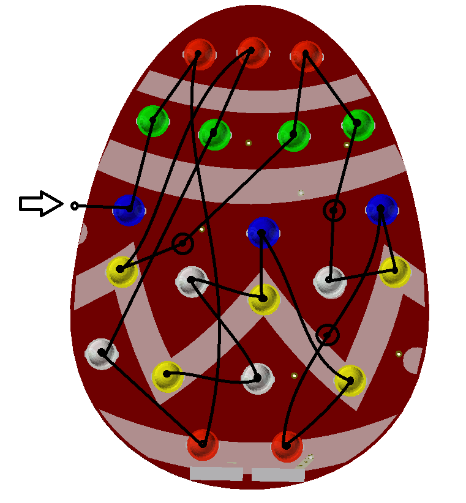

# LedEgg

WAK-Lab project 
* Atiny 25/45/85 based
* 3 74HC595D 8-bit serial-in, serial or parallel-out shift register with output latches
* 21 LEDs

## Led chain
3 positions are not connectet to a led but take a place in the serial stream of 3 bytes

